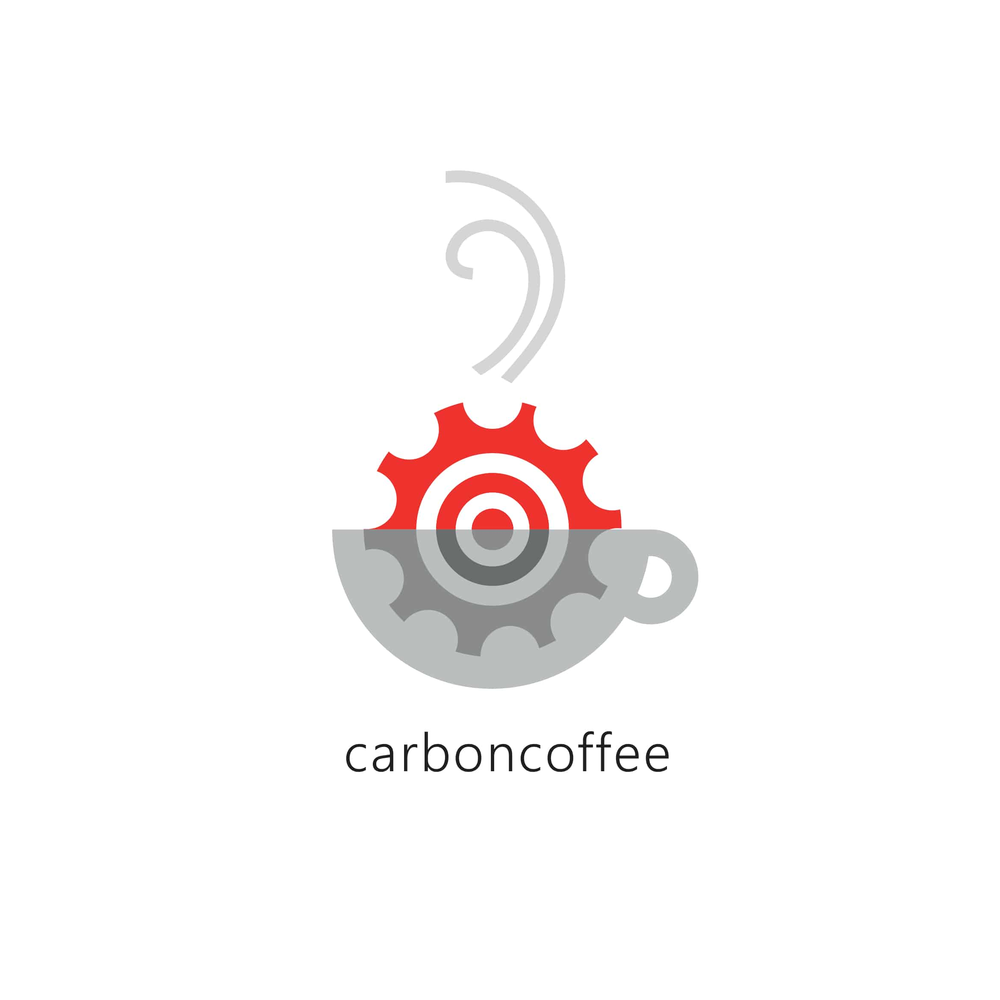

<!DOCTYPE html>
<html lang="en" dir="ltr">
  <head>
    <meta charset="utf-8">
    <title>Vera Örså's Portfolio</title>

    <link href="https://fonts.googleapis.com/css?family=Open+Sans:300|Raleway:300&display=swap" rel="stylesheet">
    <link rel="stylesheet" href="css/styles.css">

    <link rel="stylesheet" href="https://maxcdn.bootstrapcdn.com/bootstrap/3.4.1/css/bootstrap.min.css">

    

    

    <link href="https://fonts.googleapis.com/css2?family=Fjalla+One&family=Open+Sans&display=swap" rel="stylesheet">

  </head>
  <body>

    

      <ul>

        <li><a href="https://dribbble.com/veraorsa">dribbble</a></li>

        

      </ul>

    

        

          <h1>Hey there!</h1> 
          
I'm Vera, a girl living in Finland who's interested in graphic design. 
             Down below you can have a look of what I've been doing.

        

        

        

       
       
       
       
       
       
       
       

       

  

  

    <ul>
         <a class="button" href="https://dribbble.com/veraorsa">Click for more</a>

         

 
         

 

    </ul>

  

  <h1 class="contact"style="padding-top:30px">Get in Touch!</h1>
  
For questions please fill in the form below.

  

  

  

    <form action="mailto:vera.oersa@gmail.com">
      <label for="fname">First Name</label>
      <input type="text" id="fname" name="firstname" placeholder="Your name..">
      <label for="lname">Email</label>
      <input type="text" id="lname" name="lastname" placeholder="Your Email address..">

      <label for="subject">Subject</label>
      <textarea id="subject" name="subject" placeholder="Write something.." style="height:170px"></textarea>
      <input type="submit" value="Send">
    </form>
  

  </body>
</html>
